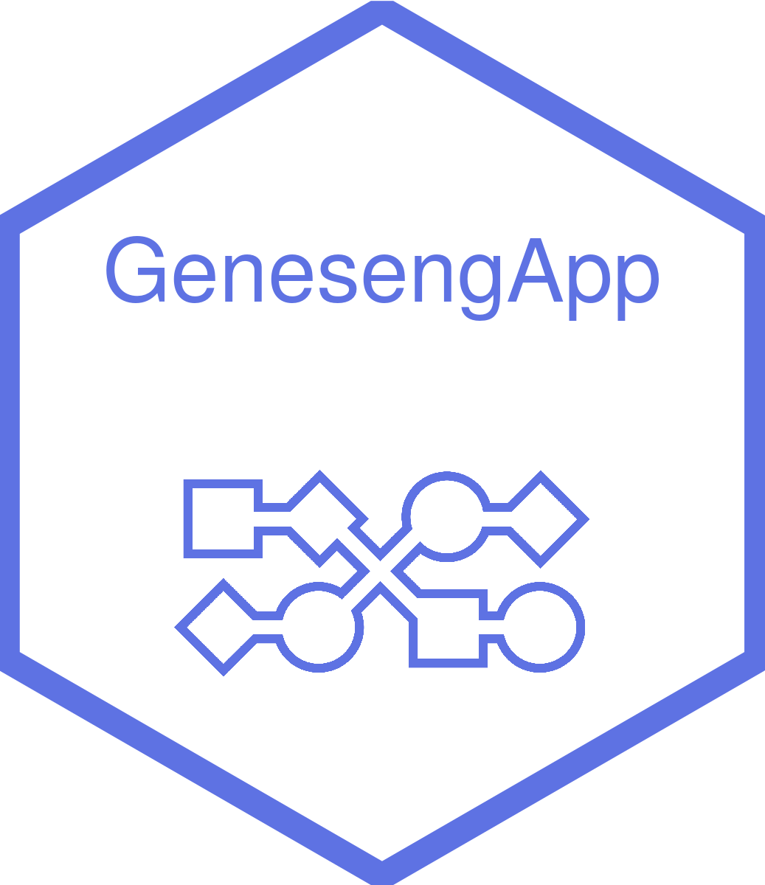

<!-- README.md is generated from README.Rmd. Please edit that file -->

# genesengApp <a href=#></a>

> Biomarker discovery as a Service

`genesengApp` is a shiny app embedding best-in-class statistical methods
and AI libraries to rapidly prototype the performance of your
biomarkers.

## Installation

#### Requirement

- Download the MySQL ODBC 8.0 Unicode Driver
- R version 4.1.0
- Edit the .Renviron file

<!-- -->

    # .Renviron
    BDD_host = "localhost"
    SQL_ID = "your_mySQL_username"
    SQL_PASSWORD = "your_mySQL_password"

    # For linux environment
    SQL_DRIVER = "Driver={MySQL ODBC 8.0};" 

    # For Windows environment
    SQL_DRIVER = "Driver={MySQL ODBC 8.0 Unicode Driver};"


### Running app in a local Docker container (linux)

``` bash
docker build --no-cache -t geneseng-demo .
docker run --network="host" -p 3838:3838 geneseng-demo
```


# Maintainer

[Alex Yahiaoui Martinez](https://github.com/alexym1)
